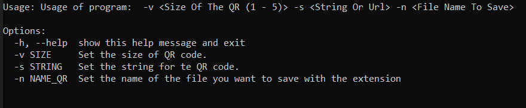

# Python QR-CODE Generator

## Requirements

* pip install qrcode

## Usage
Usage: qr_generate [Options
    Made to generate own QR code.
    Developed by Çetin Boran Mesüm -> (Github: cetinboran)

